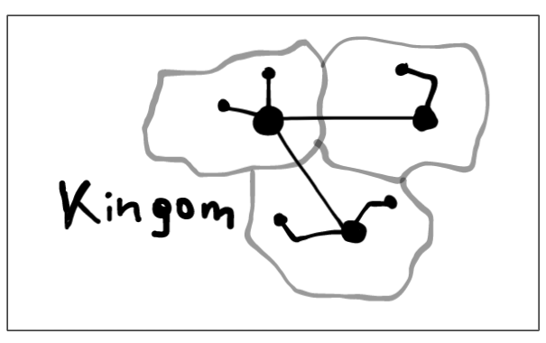
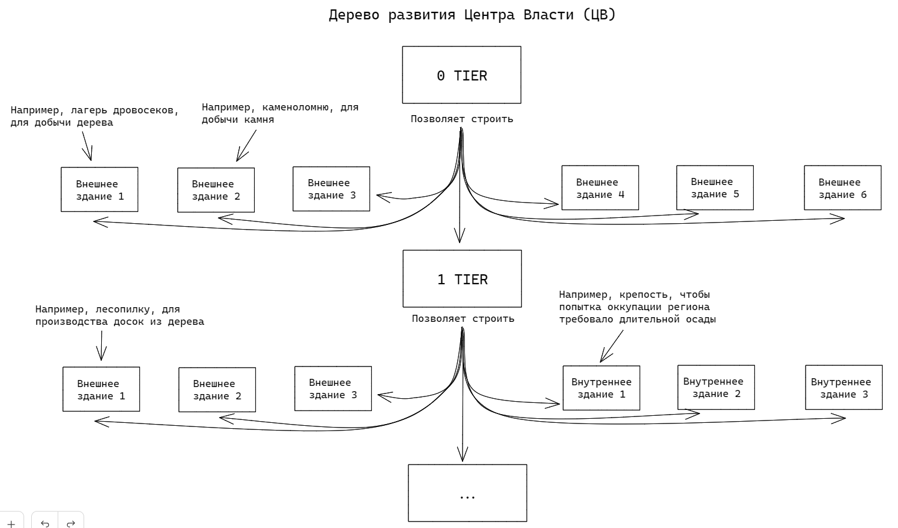
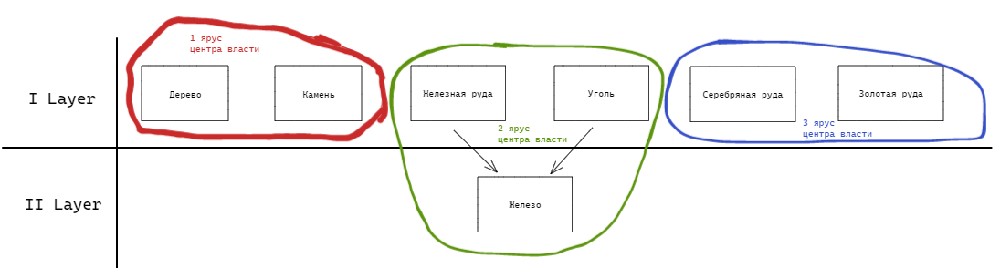
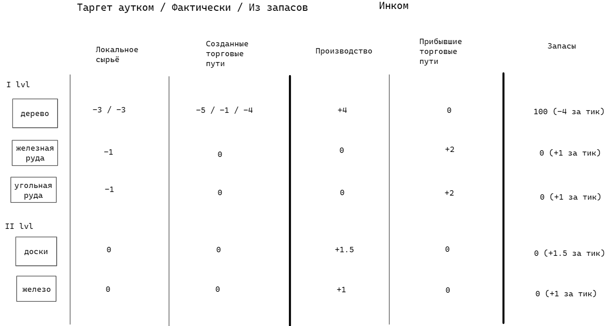
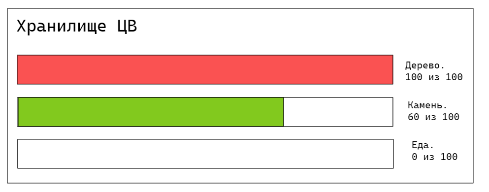

# Экономическая система

---

## Общая идея

Общая идея, лежащая в основе экономической части геймплея - это представление 
государства игрока как систему, узлы которой являются центрами власти. 
Центры власти захватывают территорию (гексы), на которой можно строить 
производственные здания. Производственные здания добывают или производят ресурсы, 
а центры власти их накапливают. Кратко говоря, геймплей сводится к развитию центров 
власти, получению доступа к производству более сложных ресурсов и налаживания 
такого производства.

---

## Регионы

Игрок владеет в первую очередь регионами. Каждый регион сам по себе требует **содержания [immutableValue]**.
Также имеется **коэффициент содержания нового региона [immutableValue]**, то есть каждый новый регион в 
распоряжении игрока будет ему обходиться дороже в содержании. *Это попытка сделать бессмысленным 
бесконтрольный захват регионов игроками.*

Пока регион не имеет какого-либо центра власти, он не приносит **экономической** выгоды.

### Центры власти

**Центр власти** (powerCenterBuilding) - это глобальное здание. **Глобальные здания конкурируют между 
собой за место на гексе**. Иными словами, на гексе может быть одно глобальное здание. 

Свойства ЦВ:

- генерирует **область контроля** (controlArea) вокруг ЦВ. Её свойства:
  - ограничена границами региона.
  - захватывает гексы, на которых можно впоследствии строить внешние постройки - добывающие или 
    производственные здания.
- получает **ячейки размещения** (placementCell), в которых можно строить внутренние постройки, 
  вспомогательные здания или открывающие специальные действия.
- генерирует доход от жителей
- обходится в содержании - *подобно содержанию региона*

**Характеристики центра власти [object]**:
- **Текущий ярус** [mutableValue] (currentTier)
- **Текущий уровень развития** [mutableValue] (currentLevel)
- **Население** [object] (population)
  - Количество жителей [mutableValue] (citizensAmount)
  - Количество рекрутов [mutableValue] (recruitsAmount)
  - Прирост населения в тик [calculableValue] (populationGrowth) === 
\(Прирост еды / 2\) - \(Количество жителей * ярус\)
  - Процент преобразования населения в рекрутов [mutableValue] (recruitConversionPercent) - от 0 до 1.
*Общий прирост населения разбивается на прирост кол-ва жителей и рекрутов. Например, прирост равен 1000 
людей, коэффициент преобразования стоит 0.5, тогда в итоге произойдет прирост 500 рекрутов и 500 жителей 
в центр власти*
- **Экономический баланс** [object] (economicBalance)
  - Доход [calculableValue] (incomePerTick) === количество жителей * ярус
  - Содержание [calculableValue] (costPerTick) === \(количество жителей / 5\) * ярус
- **Хранилище** [object] (storage)
  - Размеры [calculableValue] (capacity) === \(100 * ярус\)
  - Хранимые ресурсы [object] (resources)
- **Область контроля** [object] (controlArea)
  - Попавшие гексы [array] (tiles)
  - Размер [calculableValue] (size) === tiles.length
  - Внешние здания [calculableValue] (externalBuildings) === controlArea.tiles
.filter(t => t.externalBuilding !== null);
- **Ячейки размещения** [object] (placementCells)
  - Максимальное количество [calculableValue] (maxAmount) === ярус - 1
  - Текущее количество [calculableValue] (currentAmount) === internalBuildings.length
  - Внутренние здания [array] (internalBuildings)

**Развитие центра власти**

Будет в теории бесконечным. Все уровни будут поделены на **Ярусы [immutableValue]** (tiers). 
Каждый ярус будет определять свой перечень **необходимых ресурсов** [immutableValue] для
последующего улучшения уровня центра Власти. Помимо этого, ярус будет определять **коэффициент 
повышения необходимого количества ресурса [immutableValue]** (resourceRequireValueRatio) для 
покупки нового уровня (для каждого необходимого ресурса).

Например, первый ярус (1 Tier) будет действовать между 0 и 5 уровнями (power center levels), 
требует ресурсы камень и дерево для улучшения центра власти и определяет коэффициенты как
120% и 115% соответствующе. Если начальной ценой повышения будет 150 и 100 ресурсов соответствующе,
тогда цены повышения уровня центра власти будет:

- 0 lvl => 1 lvl : 150 дерева, 100 камня
- 1 lvl => 2 lvl : 150\*1.2=180 дерева, 100\*1.5=115 камня
- 2 lvl => 3 lvl : 216 дерева, 132 камня
- 3 lvl => 4 lvl : 259 дерева, 152 камня
- 4 lvl => 5 lvl : 311 дерева, 174 камня

Каждый ярус определяет:

- список внешних зданий, которые можно будет строить в его зоне контроля [immutableValue]
- список внутренних зданий, которые можно будет строить в его ячейках размещения

**Безусловный базовый доход**

Помимо этого, каждый ярус будет приносить **безусловный базовый доход ресурсов** [immutableValue], 
которые используются для улучшения на первом ярусе. Сделано это с той целью, чтобы игрок не смог 
зайти в непреодолимый тупик в своём развитии.

*Таким образом, нам достаточно только дать игроку начальный капитал для постройки первого ЦВ. Это 
всё что нужно для дальнейшей "раскачки". Этот базовый доход может быть в размере 1/10 от добычи 
ресурса соответствующим внешним зданием.*

**Постройка и снос центра власти**

Постройка происходит через "глобальные действия" - нажимаем кнопку и выбираем свободный гекс для 
постройки ЦВ. Технически строить ЦВ рядом друг с другом **нельзя** (*Но выходит, можно через 
1 гекс*). Технически коллизия областей контроля разных ЦВ возможна, однако внешние здания -
глобальны, поэтому на гексе будет лишь одно внешнее здание, принадлежащее одному ЦВ.

Постройка ЦВ имеет **определенную цену золотом** [immutableValue], а также занимает **определенное 
количество тиков** [immutableValue] для постройки. 

Рельеф и биом гекса сохраняются при строительстве ЦВ. Если ЦВ снести, то гекс будет первозданным.

Снос происходит с помощью выбора соответствующего ЦВ и нажатия соответствующей кнопки. Занимает 
это **определенное количество тиков** [calculableValue], которое зависит от количества внешних зданий 
у этого ЦВ (*и населения?*).

### Ресурсы

Ресурсы делятся на слои (подобно как центры власти на ярусы). На первом слое расположены
исключительно **добывающиеся ресурсы**. На последующих слоях находятся исключительно **производимые
ресурсы**. При этом, каждый ресурс последующего слоя, начиная со второго, имеет в зависимостях
ресурсы с предыдущего слоя, для производства этого ресурса. По сути, зависимость ресурсов между
слоями образует граф:

На графе видно, что помимо слоёности, из ресурсов можно составить группы - какие ресурсы доступны
в добыче/производстве на конкретном ярусе центра власти.

**Ресурс однозначно является сырьём для другого ресурса**

Если мы сделаем, что конкретный ресурс будет **сырьём** только для **одного** другого ресурса, то 
это значительно облегчит задачу в обработки протекания ресурсов. Иначе, придётся формировать 
приоритеты.

*Например, если мы будем знать, что дерево является сырьём для досок и лодок, то в случае 
недостатка сырья (требуется 15 дерева в тик, а у нас только 7), придётся выяснять какая из цепочек 
производства не дополучит дерева - доски или лодки.*

### Внешние постройки

**Внешняя постройка** (externalBuilding) - это глобальное здание, которое размещается в области
контроля центра власти и прикреплено к нему. *Назначение внешних построек состоит исключительно 
в добыче или производстве кого-то ресурса.*

Любая внешняя постройка имеет:

- **определенную стоимость в виде ресурсов** [immutableValue]
- **содержание золотом в тик** [immutableValue]
- **количества тиков, занимаемое на строительство** [immutableValue]
- **количества тиков, занимаемое на снос** [immutableValue]
- **производство/добычу определенного количества ресурса в тик** [calculableValue]

**Постройки и снос внешнего здания**

Для постройки внешнего здания необходимо выбрать желаемый ЦВ. Дальше соблюдаются условия:

- в области контроля ЦВ есть свободный гекс
- в ЦВ есть достаточно необходимых ресурсов для постройки

После выбранного внешнего здания для строительства, игрок выбирает гекс на котором будет здание.

При строительстве здания по **добыче** ресурсов, требуется также выполнение условий в виде 
определённого  вида местности или залежей ресурсов (*например, лесопилку нужно ставить на гекс с 
лесом, ферму на гекс с равнинами или лугами*).

Для сноса внешнего здания, требуется выбрать соответствующую постройку и нажать соответствую кнопку 
по сносу.

### Внутренние постройки

Внутренние постройки строятся в ячейках размещения конкретного ЦВ. То есть, они не видны на глобальной
карте.

Делятся на:

- **бонусные** (buff) - процентно увеличивают прирост чего-то или абсолютно какие-то значения в том
  ЦВ, где построены. Возможные бонусные внутренние здания:
  - Склад, увеличивающий размер хранилища ресурсов
  - Налоговая, увеличивающая процент с налогов
  - Цех, дающий модификатор к производству на один любой ресурс
- **специальные** (special) - открывают специальные действия в этом ЦВ или глобально. Возможные
  специальные внутренние здания:
  - [Центр колоний](./diplomacy.md)
  - Гильдия, что позволяет создавать торговые пути в другие регионы
  - Рынок, что позволяет создавать торговые пути в другие государства и создавать предложения
    на торговые пути для других игроков. Может быть только в одном ЦВ.

Любое внутреннее здание имеет своё значение:

- **стоимости в ресурсах** [immutableValue]
- **количества тиков, занимаемое на строительство** [immutableValue]

В отличие от внешних зданий, внутренние здания не требуют содержания золотом в тик. Также, отсутствие
ожидания тиков по сносу здания обусловлено тем, что внутренние здания **заменяются**. *То есть, если
в ЦВ будет построено какое-нибудь внутреннее здание (например, налоговая) то игроку не нужно его сносить.
Он может просто выбрать иное (например, рынок) и подождать пока произойдет замена (постройка)*.

### Дороги

Дороги являются глобальными зданиями, которые имеют значение **стоимости в золоте** [immutableValue].
*Дороги не имеют коэффициента и их количество не влияет на цену новой дороги*

Дороги строятся "глобально" подобно центрам власти и моментально. Строить возможно на любом свободном 
гексе, принадлежащем региону, что принадлежит игроку. Снос дорог также происходит моментально, но не 
возвращает потраченных ресурсов. Для сноса понадобиться отдельное "глобальное" действие рядом с 
постройкой дорог.

Назначение дорог в соединении центров власти: внутри одного региона, между регионами и между регионами 
государств.

### Торговые пути

Один центр власти не сможет производить всевозможные ресурсы, более того удобно логически 
**специализировать** центры власти. Для такой возможности игроку доступно отправлять 
торговые пути из ЦВ в другие ЦВ. Это однонаправленные в конкретный ЦВ из конкретного ЦВ караваны, 
передвигающие определенное количество конкретного ресурса в тик.

Есть три вида торговых путей:

- **Локальный** - между центрами власти, что находятся внутри одного региона. 
- **Внутренний** - между центрами власти, что находятся в разных регионах.
- **Внешний** - между центрами власти, что находятся в разных регионах, в разных государствах. Иначе 
  говоря, это механизм торговли ресурсами между игроками.

**Пропускная способность ЦВ**

У каждого ЦВ будет показатель **общей пропускной способности**[calculableValue], зависящий от уровня 
яруса. Он будет определять сколько **максимально** сможет отправлять ЦВ единиц ресурса в тик. Это 
значение будет распределяться между всему торговыми путями.

Допустим у нас будет 2 торговых пути в один и тот же ЦВ, но передающие разные ресурсы. Если ОПС в этом 
ЦВ равно 5, то...

Игрок может сделать:
- 1 тг : 3 единицы ресурса в тик
- 2 тг : 2 единицы ресурса в тик

Необязательно распределять всё ОПС:
- 1 тг : 1 ед. р. в тик
- 2 тг : 2 ед. р. в тик

**Создание локального торгового пути**

- Выбрать ЦВ-источник, в котором будет создаваться торговый путь
- Нажать "создать торговый путь"
- Выбрать ЦВ-приёмник, который находится внутри региона, что и ЦВ-источник, а также связан с ним
  дорогой
- Выбрать ресурс, который будет отправляться из ЦВ-источника в ЦВ-приёмник 
- Определить **количество передаваемого ресурса в тик**[mutableValue] - может быть включительно 
  от 0 до оставшегося в наличии ОПС (общей пропускной способности)
- Нажать "создать"

**Создание внутреннего торгового пути**

- Выбрать ЦВ-источник, в котором создаётся торговый путь
- Построить в ЦВ-источнике специальное внутреннее здание - Гильдию
- Нажать "создать внутренний торговый путь"
- Выбрать ЦВ-приёмник, который находится в любом регионе, что принадлежит игроку, а также связан с 
  ЦВ-источником дорогой
- Выбрать ресурс, который будет отправляться из ЦВ-источника в ЦВ-приёмник
- Определить **количество передаваемого ресурса в тик**[mutableValue] - может быть включительно
  от 0 до оставшегося в наличии ОПС (общей пропускной способности)
- Нажать "создать"

**Внешний торговый путь**

В отличие от двух других торговых путей, которые однонаправленные, этот является двунаправленным. 
Он состоит из трех этапов: 

1. Заключение первым и вторым игроков договора по торговле
2. Создание первым игроком **предложения**:
   - Выбрать ЦВ-источник-предложения, в котором будет действовать предложение
   - Построить в ЦВ-предложение специальное внутреннее здание - Рынок
   - Нажать "создать новое предложение"
   - Определить коэффициенты обмена [mutableValue] - получаемый ресурс или деньги И 
     отправляемый ресурс или деньги. Одно из значений может быть нулём. (*Например, 
     5 золота меняю на 1 дерево. Или 1 дерево меняю на 5 камня*) 
   - Определить максимальное количество отправляемого ресурса или денег в тик [mutableValue] - может 
     быть от 0 до количества излишка данного ресурса в тик (*Например, у игрока в конкретном ЦВ 
     излишка дерева 15 единиц в тик. Он может создать предложение, меняя 1 дерево на 1 камень, указав 
     максимальное количество отдаваемого дерева в тик - от 0 до 15 штук.*)
   - Нажать "создать"
3. Создание вторым игроком **внешнего торгового пути**:
   - Выбрать ЦВ-источник-пути, в котором создаётся внешний торговый путь
   - Построить в ЦВ-путь специальное внутреннее здание - Рынок
   - Нажать "создать внешний торговый путь"
   - Выбрать ЦВ-источник-предложения первого игрока, в который будет отправлен торговый путь. Он 
     должен быть соединён дорогой с ЦВ-источником-пути.
   - Определить количество отправляемого ресурса в тик [mutableValue] - может быть от 1 до количества 
     оставшегося предложения ИЛИ оставшегося в наличии ОПС 
     (*То есть. Первый игрок создал предложение с максимальным количеством 
     отдаваемого дерева в тик - 15 штук. Это предложение могут выполнить разные игроки. Допустим, один 
     отправит камня на 5 дерева в тик, другой на 5. Тогда последнему игроку будет доступно максимально 
     ещё 5.*

     *Забавно, что если один из игроков захочет передавать 10 дерева в тик, то он не сможет это сделать, 
     пока другие игроки не сбавят количество отправляемого ресурса в тик. Иначе говоря, тут работает 
     принцип кто успел, тот успел, что в теории приведёт к необходимости договариваться или устроить 
     бойню не на жызнь, а на смерть. За дерево.*)
   - Нажать "создать"

**Приоритеты торговых путей**

ОПС не связан с фактическим производимым излишком в ЦВ (*У нас фактически производится 5 дерева 
в тик, а мы создали торговый путь на 15*). То есть, в случае нескольких торговых путей и недостатка 
необходимого производства, игроку нужно будет определять приоритеты торговых путей в этом ЦВ. 
Те что выше, раньше получают необходимый ресурс.

*Фактически, это как приоритеты строительства войск в ХОИ 3.*

### Жизненный цикл ресурсов

У каждого ЦВ существует своя отчётность, описывающая **требования и инком** каждого ресурса.

**Жизненный цикл инкома ресурса**

- Автоматически используется как сырье в производстве другого внешнего здания в этом ЦВ (если
таковое существует)
- Отправляется по торговым путям, в соответствии с выставленными приоритетами (если существуют)
- Отправляется в хранилище
- Если хранилище переполнено, просто беследно исчезает...

При строительстве внешнего здания по **производству** ресурса, для его **работы** необходимо получение
соответствующего **сырья** в тик, нужного для производства. *Например, для производства 1 железа
в тик, нужно получение 1 угля и 1 железной руды в тик в этом ЦВ - через соответствующие внешние
здания или караваном. Это также значит, что здание будет построено независимо от того, есть ли
поступление необходимого сырья или нет. В случае его отсутствия здание просто не будет ничего
производить, но обходиться копеечкой*.

**Накопление добытого/произведённого ресурса**

У каждого ЦВ есть показатель хранилища. Он касается каждого ресурса в отдельности. То есть, например,
это значение равно 100. И если в ЦВ накопится 100 дерева, а камня 60, то камень накапливаться
продолжит, а дерево нет.

