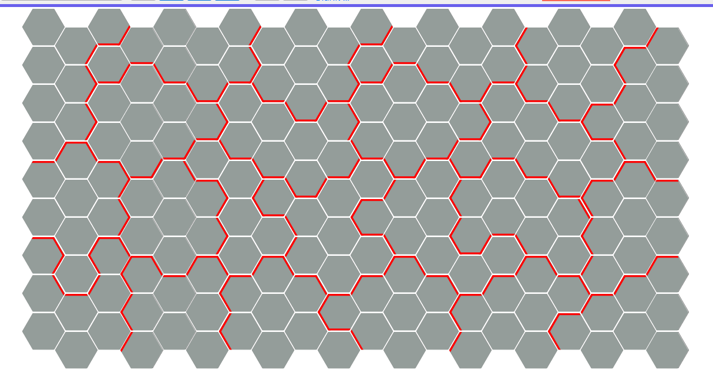
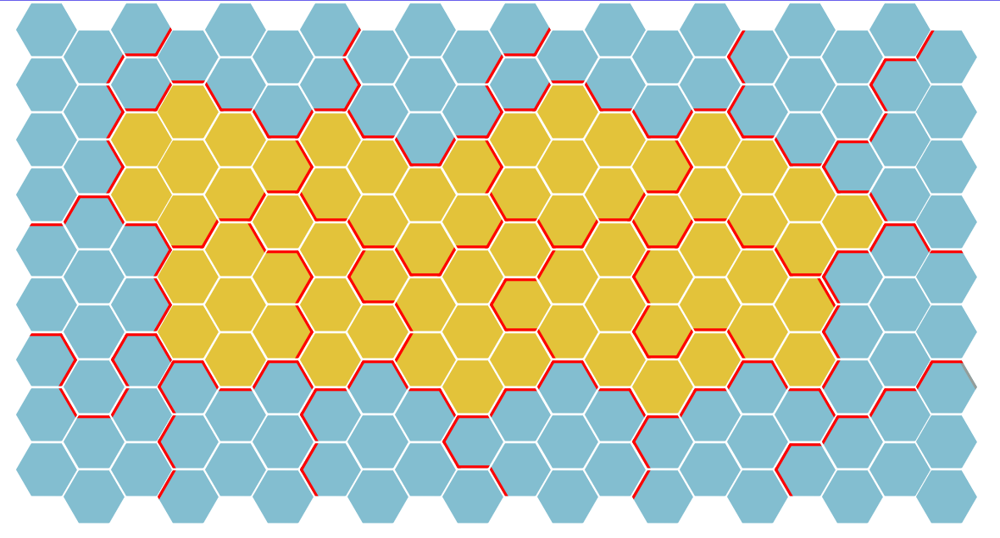
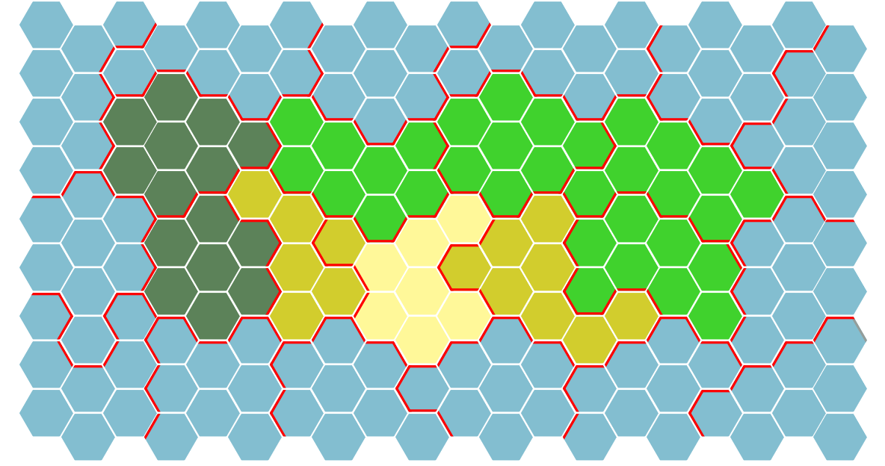
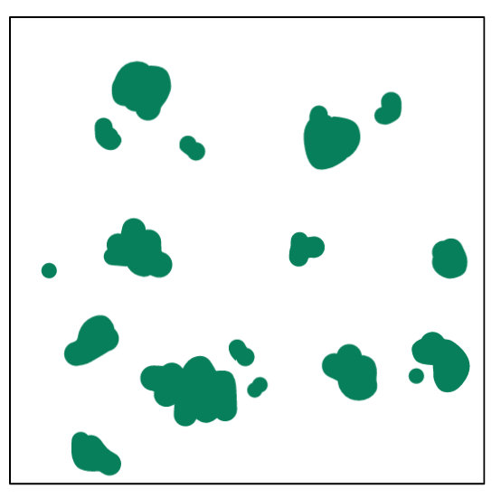
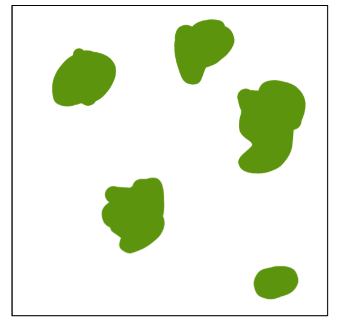

# Карта

## Гекс

Вся карта будет состоять из шестиугольников (гексов).

> **Типы гексов** (TileTypes)
> - земля (land)
> - море (sea)

> **Биомы** (BiomTypes)
> - луга (grassland)
> - степи (flatland)
> - тундра (tundra)
> - пустыня (dessert)

> **Рельеф** (ReliefTypes)
> - отсутствует (none)
> - лес (forrest)
> - джунгли (jungle)
> - холмы (hills)
> - горы (mountains)

**Свойства гекса [object]**:
- биом (biom)
- рельеф (relief)
- тип (type)
- регион (region) - *которому принадлежит гекс*
- for-dev only
    - температура (temperature)
    - влажность (moisture)

## Регион

Гексы будут объединены в регионы. Количество гексов в регионе всегда 
одинаково [immutableValue]. (*Допустим, это значение на текущий момент 
будет 12 гексов*)

**Характеристики региона** [object]:

- гексы (hexes) - *что принадлежат региону*
- тип (type) - *суша/вода*
- биом - *то есть у всех гексов региона должен быть одинаковый биом*

Регион имеет дополнительные характеристики, если он нейтрален. Смотри [присоединение 
нейтральных регионов](./diplomacy.md)

## Процесс генерации карты

### 1) Деление всей карты на регионы

*Это оставит возможность добавления морских юнитов и морских торговых путей 
впоследствии.*

*Картинка демонстрационная. Тут вообще есть регионы с 5 гексами...*

> **Размеры карты** (MapSizes) *учитывая, что регион 12 гексов*
> - малые (small) - 50 регионов, 600 гексов, 30х20 размеры
> - средние (medium) - 80 регионов, 960 гексов, 40х24 размеры
> - большие (big) - 120 регионов, 1440 гексов, 48х30 размеры

### 2) Выявление земли и моря

Любая генерируемая карта будет являться пангеей, окружаемая со всех сторон 
морем. Все регионы **на границе** карты помечаются как море. Остальные помечаются 
землей. 

### 3) Раскраска биомов

Раскрашиваются биомы регионально. Выбираются как в реальном мире - на полюсах 
тундра, далее следуют луга (много влажности) и степи (мало влажности), ближе 
к экватору пустыни.

*Тут я понял, что у меня слишком мало получилось регионов, поэтому я 
разукрасил её абы-як. Ещё и неправильно в одном регионе.*

*Значение влажности и температуры у нас пока будет всегда одинаковым.*

### 4) Генерация рельефа. Высоты

Генерируются по всей суши (*Через SimplexNoise, очевидна*). Генерация должна быть
"разряженной".

*Тот вариант, что у вас получился, нам был по нраву. Только не помним применяли 
ли вы его*

### 5) Генерация рельефа. Растительность

**Леса**

Генерируются на: 
- тундра
- степь
- луга

Если попадают на холм, то холм остаётся. Генерация должна быть "группами" (*Иначе 
говоря без октав или малым их влиянием*) с возможными "одиночками".

**Джунгли**

Генерируется на:
- луга
- степь

Если попадают на холм, то холм остаётся. Генерация должна быть не разряженными 
группами.

